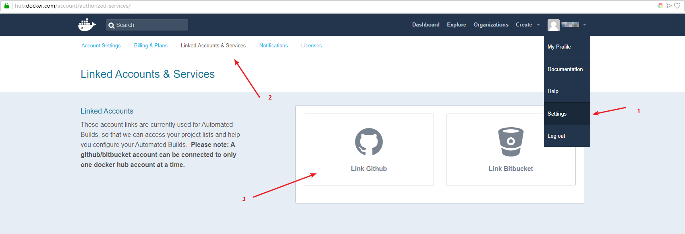
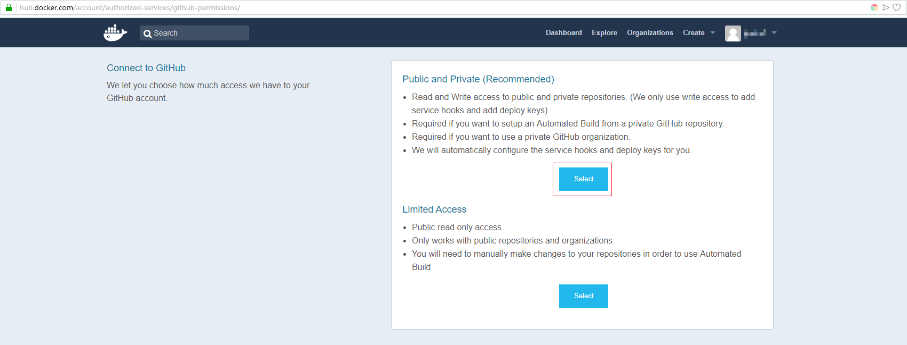

# 简介

 - 假如你有一个比较好的docker镜像怎么发布出来供大家使用呢？  
 - 你是否遇到过国外某些镜像很难下载下来呢？  
 - 你是否想过拥有一个自己的镜像仓库呢？

本文将介绍如何使用[Docker Hub](https://hub.docker.com/)和[阿里云](https://www.aliyun.com/)的容器镜像服务来创建自己的docker镜像仓库

<!-- more -->

# Docker Hub
 1. 登录[https://hub.docker.com](https://hub.docker.com)
 2. 注册一个Docker Hub用户
 3. 绑定GitHub账号  
    点击【Setting】 - 【Linked Accounts & Service】绑定Github账号
    

    选择Public and Private
    

    跳转至GitHub页面，授权即可

    授权后可以看到已经绑定成功
    

# 阿里云 镜像容器服务